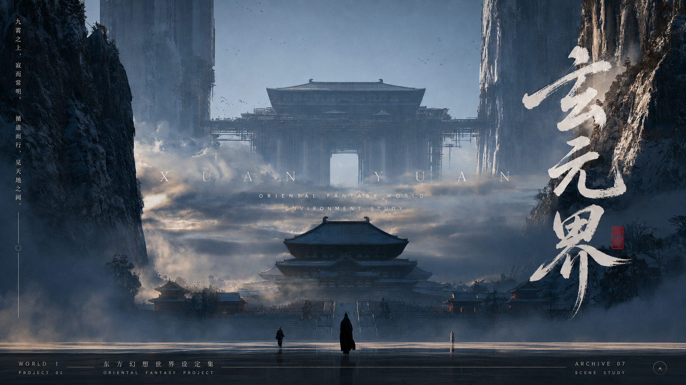
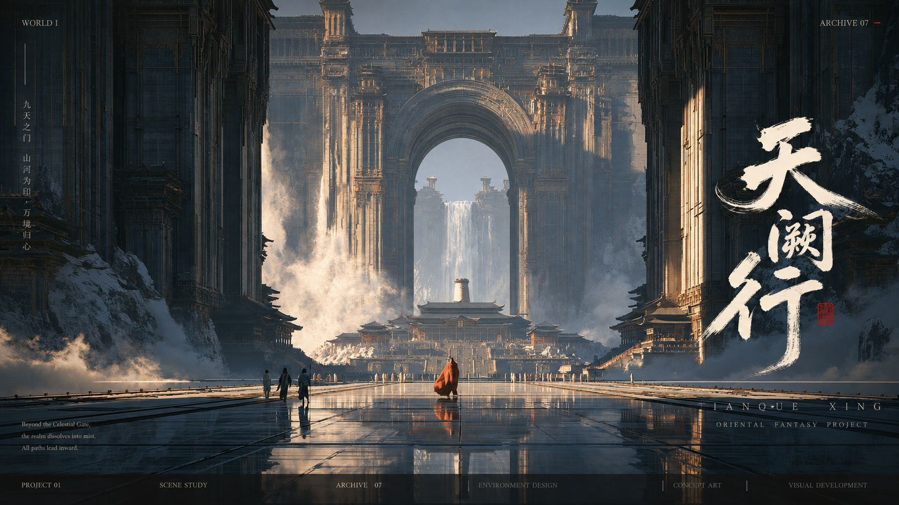
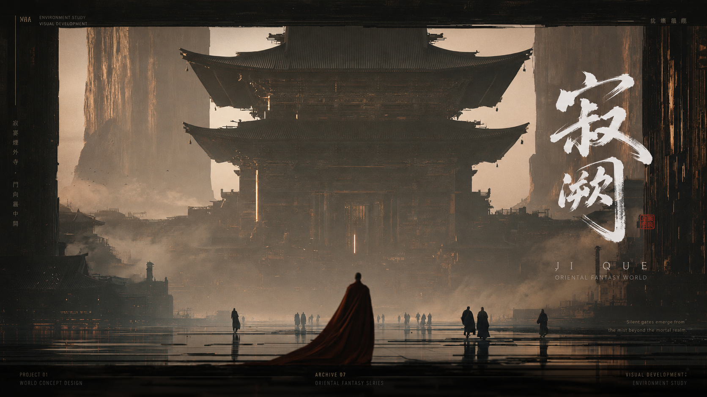

# 裁霞入笺 · Codex Skill

**裁霞入笺（Caixia Rujian）**，项目标识 **`caixia-rujian`**：用于国风游戏概念海报设计的 Codex Skill。

把你的原图做成东方幻想游戏概念海报：尽量保留画面主体与构图，加入书法标题、极简英文、小型印章与专业信息排版。

## 效果展示

以下四组来自实际使用示例：以原图为基础，完成标题设计、调色与信息排版。

### 冷色云海

### 巨门城阙

### 暖色殿宇

### 桥廊山境

## 原图与效果对比

展开查看同一场景的原图与海报效果，点击图片可查看大图。

01 · 冷色云海

| 原图 | 使用 Skill 后 |
| --- | --- |
|  |  |

02 · 巨门城阙

| 原图 | 使用 Skill 后 |
| --- | --- |
|  |  |

03 · 暖色殿宇

| 原图 | 使用 Skill 后 |
| --- | --- |
|  |  |

04 · 桥廊山境

| 原图 | 使用 Skill 后 |
| --- | --- |
|  |  |

## 适合什么画面

东方幻想、武侠、修仙题材的角色图、建筑图、场景原画，以及希望呈现游戏世界观宣传视觉的图片。

## 它会做什么

- 根据画面气质创作 2—4 字中文标题，搭配飞白、枯笔感的书法设计。
- 配上原创英文副标题、少量竖排中文、章节编号和微型说明。
- 根据主体位置安排文字，利用留白，避开人物面部和重要视觉焦点。
- 采用克制的电影感调色，结合东方美学与现代编辑排版。
- 尽量保留原图的人物、建筑、镜头与主要构图。

## 使用方法

在具备图片生成或编辑工具的 Codex 环境中加载本 Skill，上传你的原始图片，然后说明：

> 使用 $caixia-rujian，把这张图片做成国风游戏概念海报。尽量保留主体和构图，根据画面创作标题与排版。

本 Skill 提供设计指引，不自带图片模型。也可以把 `SKILL.md` 的内容作为设计说明，连同原图交给支持图片编辑的工具。

## 文件说明

- `SKILL.md`：裁霞入笺的设计说明与触发条件。
- `agents/openai.yaml`：Codex 中的展示名称与示例指令。
- `README.md`：本项目的中文介绍与使用方式。
- `assets/examples/`：四组原图与海报效果图。

本 Skill 提供设计指导，需要配合具备图片生成或编辑能力的工具使用。主体保真程度和文字呈现取决于所使用的工具，成图后请核对。

## 名称说明

中文项目名：**裁霞入笺**；英文名称：**Caixia Rujian**；Skill 标识：**`caixia-rujian`**。

名字取意：裁云霞之色，入一纸素笺。用于保留原图主体的国风海报设计。
